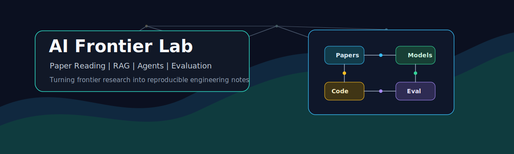
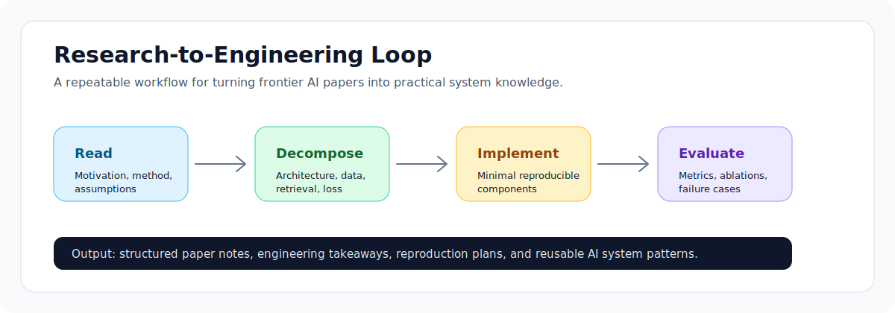

# AI Frontier Lab




This repository tracks frontier AI research, paper reading, and engineering practice over the long term. The main focus areas include large language models, RAG, multimodal learning, efficient training and inference, AI agents, and evaluation systems.

The core goal is simple: break down important research ideas, understand why they work, and turn them into reproducible, explainable, and engineering-aware technical notes.

## Latest Paper Notes

| Paper | Venue | Direction | Key Idea |
| --- | --- | --- | --- |
| [LinearRAG: Linear Graph Retrieval Augmented Generation on Large-scale Corpora](papers/rag/2026-iclr-linearrag.md) | ICLR 2026 Poster | GraphRAG / RAG | Replaces unstable relation extraction with a relation-free Tri-Graph, enabling linear-scale graph retrieval with no extra LLM token cost during graph construction |
| [Stronger-MAS: Multi-Agent Reinforcement Learning for Collaborative LLMs](papers/agent-rl/2026-iclr-stronger-mas.md) | ICLR 2026 | Agent RL / MAS | Uses agent- and turn-wise GRPO to train collaborative LLM teams for long-horizon planning, coding, games, and math |
| [Agent Lightning: Train ANY AI Agents with Reinforcement Learning](papers/agent-rl/2025-agent-lightning.md) | arXiv 2025 | Agent RL / Training Systems | Decouples agent execution from RL training through a unified trajectory interface and LightningRL credit assignment |
| [ReVeal: Self-Evolving Code Agents via Reliable Self-Verification](papers/code-agents/2025-reveal.md) | arXiv 2025 / ICLR 2026 | Code Agents | Trains code agents to improve through iterative generation, self-verification, tool feedback, and turn-level rewards |

## What This Repository Shares

- Frontier AI paper notes: motivation, method design, experiments, limitations, and takeaways
- Research roadmaps: LLMs, RAG, multimodal AI, agents, efficient AI, and evaluation
- Engineering reproduction notes: minimal implementations distilled from paper methods
- Experiment and evaluation summaries: data, metrics, ablations, failure cases, and improvement ideas
- Practical technical observations: new models, frameworks, datasets, benchmarks, and deployment trends

## Focus Areas

| Direction | Topics |
| --- | --- |
| Large Language Models | Transformer, instruction tuning, alignment, long-context modeling, reasoning, tool use |
| RAG | embeddings, chunking, vector search, reranking, hybrid retrieval, evaluation |
| AI Agent | planning, memory, tool calling, workflow orchestration, multi-agent systems |
| Multimodal AI | vision-language models, contrastive learning, image-text alignment, multimodal reasoning |
| Efficient AI | LoRA, QLoRA, distillation, quantization, pruning, KV cache, inference optimization |
| Evaluation | benchmark analysis, ablation study, hallucination evaluation, production metrics |

## Repository Structure

```text
AI-/
+-- README.md
+-- papers/
|   +-- README.md
|   +-- template.md
|   +-- rag/
|   +-- agent-rl/
|   +-- code-agents/
|   +-- multimodal/
|   +-- efficient-ai/
|   +-- evaluation/
+-- assets/
|   +-- ai-frontier-lab-banner.svg
|   +-- research-workflow.svg
|   +-- papers/
+-- projects/
    +-- README.md
```

## Paper Reading System



Each paper note is organized around a consistent set of questions:

1. What problem does the paper solve?
2. What is the core contribution?
3. What are the method structure, training objective, data, and inference process?
4. What do the experiments actually prove?
5. Where is the real improvement compared with prior methods?
6. What assumptions, costs, and limitations does the method have?
7. Which ideas can be transferred into real projects?
8. How can a minimal reproduction be built?

The paper index is maintained in [papers/README.md](papers/README.md). Each important paper will receive a standalone note.

## Engineering Notes

Research ideas worth reproducing will be decomposed into smaller engineering tasks, such as:

- Implementing core modules such as Transformer, Attention, and KV Cache from scratch
- Building a RAG pipeline with document chunking, vector retrieval, reranking, generation, and evaluation
- Reproducing efficient training methods such as LoRA, QLoRA, and distillation
- Analyzing open-source model inference performance, memory usage, and deployment optimization
- Breaking down multimodal model architectures and experiment designs

The project index is maintained in [projects/README.md](projects/README.md).

## Update Rhythm

This repository is maintained as a long-term technical output space:

- Regularly track recent AI papers worth reading
- Add structured notes for important research work
- Add experiment code and engineering analysis for reproducible methods
- Track new models, frameworks, datasets, and benchmarks in a concise way

## Technical Taste

The technical content I value usually has three qualities:

- Conceptually clear: it explains complex methods without hiding behind jargon
- Empirically grounded: it is supported by experiments, metrics, and ablations
- Engineering-aware: it discusses data, compute, latency, cost, evaluation, and deployment constraints

AI moves quickly. This repository is an attempt to turn fragmented information into searchable, reusable, and reproducible technical records.
