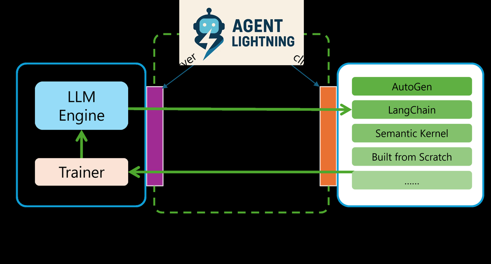
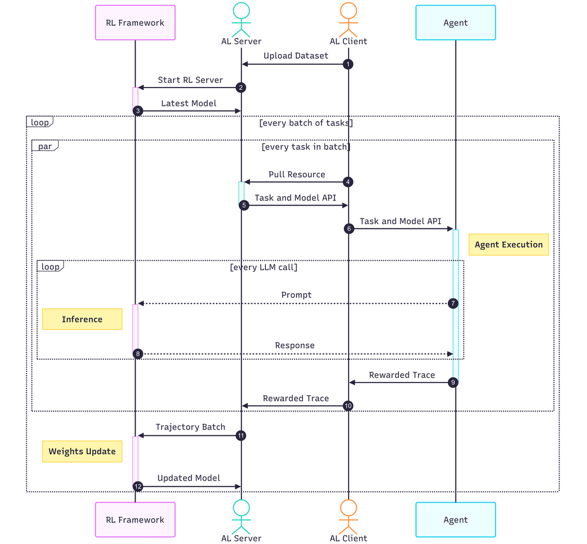

# Agent Lightning: Train ANY AI Agents with Reinforcement Learning

## Basic Info

- Paper: Agent Lightning: Train ANY AI Agents with Reinforcement Learning
- Authors: Xufang Luo, Yuge Zhang, Zhiyuan He, Zilong Wang, Siyun Zhao, Dongsheng Li, Luna K. Qiu, Yuqing Yang
- Institution: Microsoft Research
- Year: 2025
- arXiv: https://arxiv.org/abs/2508.03680
- Code: https://github.com/microsoft/agent-lightning
- Tags: agent RL, decoupled training, LightningRL, trajectory decomposition, agent observability

## One-Sentence Summary

Agent Lightning decouples agent execution from RL training so existing LLM agents can be optimized with reinforcement learning with almost no changes to the original agent code.

## Motivation

Most RL training pipelines for agents tightly couple rollout execution, trajectory formatting, reward calculation, and policy optimization. This makes it hard to train agents built with real-world frameworks such as LangChain, AutoGen, OpenAI Agents SDK, or custom agent stacks.

The paper argues that agent training should look more like system integration: existing agents should keep running in their own framework, while a separate training system observes trajectories, assigns credit, and updates the model.

## Core Idea

Agent Lightning introduces a Training-Agent Disaggregation architecture.

The agent side keeps its original execution logic. The training side receives standardized trajectory data through a unified interface, performs credit assignment, and optimizes the underlying LLM policy with LightningRL.

This separation enables RL for agents without rewriting the agent into a trainer-specific rollout format.

## Method Details

### 1. Training-Agent Disaggregation

Agent execution and model training are split into separate components:

- the agent runtime executes tasks through normal tools and frameworks
- the training server collects traces, rewards, and model interaction records
- the RL trainer converts agent traces into training transitions

### 2. Unified Data Interface

The framework defines a standard representation for agent trajectories. This makes the trainer less dependent on a specific agent framework.

### 3. LightningRL

LightningRL formulates agent execution as a Markov decision process and decomposes complex multi-step trajectories into training transitions. Its credit assignment module is designed to handle dynamic workflows, tool calls, and multi-agent scenarios.

### 4. Observability as Training Infrastructure

The system borrows observability ideas from agent runtime systems. Rather than forcing agent developers to manually expose RL internals, it collects structured execution traces that can be used for optimization.

## Experiments

The paper evaluates Agent Lightning on:

- text-to-SQL
- retrieval-augmented generation
- math tool-use tasks

The reported results show stable and continuous improvements across tasks, suggesting that the decoupled architecture can train real agent systems rather than only simplified toy rollouts.

## Strengths

- Agent code and RL code are decoupled, making the framework practical for existing agents.
- Supports common development styles such as LangChain, AutoGen, OpenAI Agents SDK, and custom agents.
- Unified trajectory representation makes the trainer more reusable.
- Credit assignment is designed for multi-step and dynamic agent workflows.
- The system framing is close to how production agents are actually built and monitored.

## Limitations

- The abstraction depends on high-quality trajectory instrumentation.
- Reward design remains difficult for open-ended agent tasks.
- Decoupling reduces integration cost but does not remove RL stability challenges.
- Production use would still require careful monitoring of policy drift, tool misuse, and unsafe exploration.

## Engineering Takeaways

- Treat agent training as a systems problem, not only an algorithm problem.
- Keep agent runtime logic separate from RL optimization logic.
- A good trace schema is a powerful interface between agents and trainers.
- Credit assignment is the core bridge from messy agent trajectories to learnable RL transitions.
- Observability data can become training data when it is structured well.

## Reproduction Plan

1. Build a small tool-using agent, such as a calculator or retrieval QA agent.
2. Instrument each model call, tool call, observation, and final reward.
3. Convert the trace into a standard trajectory format.
4. Implement a simple credit assignment baseline.
5. Compare prompt-only execution with RL-updated execution on repeated tasks.

## Interview Notes

Agent Lightning matters because it makes RL training compatible with real agent frameworks. Its main insight is that agent execution and RL optimization should be decoupled through a unified data interface and trace-based credit assignment.
