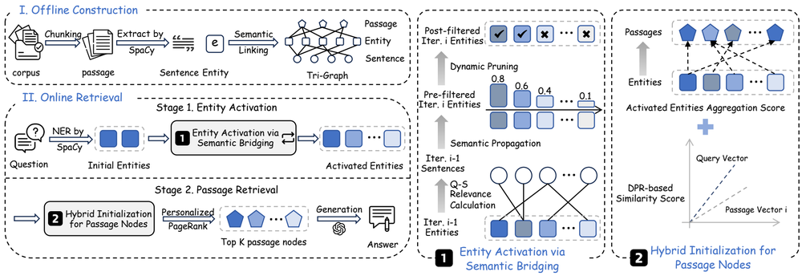
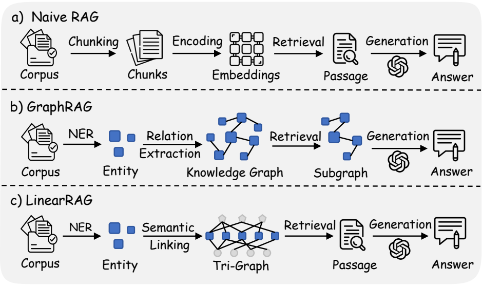

# LinearRAG: Linear Graph Retrieval Augmented Generation on Large-scale Corpora

## Basic Info

- Paper: LinearRAG: Linear Graph Retrieval Augmented Generation on Large-scale Corpora
- Authors: Luyao Zhuang, Shengyuan Chen, Yilin Xiao, Huachi Zhou, Yujing Zhang, Hao Chen, Qinggang Zhang, Xiao Huang
- Institution: Department of Computing, The Hong Kong Polytechnic University
- Venue / Year: ICLR 2026 Poster
- arXiv: https://arxiv.org/abs/2510.10114
- OpenReview: https://openreview.net/forum?id=mCtfkypdm6
- Code: https://github.com/DEEP-PolyU/LinearRAG
- Tags: RAG, GraphRAG, retrieval, multi-hop QA, efficient indexing, Personalized PageRank

## One-Sentence Summary

LinearRAG simplifies GraphRAG construction with a relation-free Tri-Graph over entities, sentences, and passages, then performs efficient multi-hop retrieval through entity activation and global importance aggregation.

## Motivation

Traditional RAG works well for simple factual queries, but it often struggles with large-scale unstructured corpora where the required evidence is scattered across multiple documents or passages. Pure vector retrieval can miss the intermediate evidence needed for multi-hop reasoning.

GraphRAG methods try to organize corpus-level relationships with knowledge graphs, but many of them rely on relation extraction or triple extraction. This creates several practical issues:

- Relation extraction is expensive and often requires extra LLM calls or complex extraction models.
- Automatically extracted relations are error-prone, and incorrect edges can push retrieval toward noisy context.
- Local extraction lacks global consistency, which can produce fragmented, duplicated, or contradictory graph structures.
- More complex graph construction increases indexing time, token cost, and maintenance cost.

LinearRAG starts from a clean observation: the value of GraphRAG is not necessarily explicit relation triples, but the ability to connect relevant evidence across passages.

## Core Idea

LinearRAG removes explicit relation modeling and uses a relation-free hierarchical graph called Tri-Graph.

Tri-Graph contains three types of nodes:

- Entity nodes: entities extracted by lightweight NER tools
- Sentence nodes: sentences split from passages
- Passage nodes: original text passages

Edges only represent containment or mention relationships:

- passage contains entity
- sentence mentions entity

The key benefit is that natural-language relations are not compressed into potentially incorrect triples. Instead, original passages remain the knowledge carrier, and the LLM can interpret the contextual relations during generation.

## Method Details

### 1. Token-Free Graph Construction

LinearRAG does not call an LLM during offline graph construction. The pipeline is:

1. Split each passage into sentences.
2. Extract entities with a lightweight NER model such as spaCy.
3. Build passage-entity and sentence-entity bipartite graphs.
4. Store adjacency relationships with sparse matrices.

This design supports incremental updates. When new passages arrive, only the new passages need sentence splitting, NER, and edge construction, so the complexity scales linearly with corpus size.

### 2. Relevant Entity Activation via Semantic Bridging

The first online retrieval stage activates relevant entities.

Directly matching entities in the query can miss intermediate bridge entities required for multi-hop questions. LinearRAG first computes semantic relevance between the query and corpus sentences, then propagates this relevance through the sentence-entity graph to activate entities that may not appear in the query but are useful for the reasoning chain.

To control the search space, LinearRAG uses dynamic pruning. Only entities whose relevance scores exceed a threshold continue to expand, which reduces semantic drift and prevents irrelevant entities from dominating retrieval.

### 3. Passage Retrieval via Global Importance Aggregation

The second stage uses the activated entities as seeds and performs global importance aggregation on the passage-entity graph. The paper uses Personalized PageRank to compute passage importance scores and selects the top-ranked passages as the final retrieval context.

This stage addresses a weakness of plain vector retrieval: it does not only look at local query-passage similarity, but also uses entity connections to estimate which passages are globally important for the reasoning path.

## Experiments

### Datasets

The paper evaluates LinearRAG on four benchmarks:

- HotpotQA
- 2WikiMultiHopQA
- MuSiQue
- Medical dataset from GraphRAG-Bench

### Baselines

The comparison includes:

- Zero-shot LLMs: LLaMA3-8B, LLaMA3-13B, GPT-3.5-turbo, GPT-4o-mini
- Vanilla RAG: Top-1 / Top-3 / Top-5 retrieval
- GraphRAG baselines: KGP, G-Retriever, RAPTOR, E2GraphRAG, LightRAG, HippoRAG, GFM-RAG, HippoRAG2

### Metrics

- Contain-Match Accuracy
- GPT-Evaluation Accuracy
- Context Relevance
- Evidence Recall

For the Medical dataset, the paper mainly uses GPT-Evaluation Accuracy because the gold answers are long descriptive statements.

### Main Results

LinearRAG outperforms the compared methods across the four datasets. Key reported results include:

- 2WikiMultiHopQA: 70.20% Contain-Acc. and 63.70% GPT-Acc.
- HotpotQA: 64.30% Contain-Acc. and 66.50% GPT-Acc.
- MuSiQue: 33.90% Contain-Acc. and 37.00% GPT-Acc.
- Medical dataset: 63.72% GPT-Acc.

The paper also reports strong efficiency on 2WikiMultiHopQA when compared with GraphRAG methods:

- LinearRAG indexing time: 249.78s
- Average retrieval time: 0.093s
- Prompt token consumption: 0
- Completion token consumption: 0
- Average accuracy: 66.95

This shows that the gain is not only accuracy, but also indexing cost, retrieval cost, and token efficiency.

## Strengths

- Removes relation extraction, which is one of the most expensive and error-prone steps in many GraphRAG systems.
- Preserves original passages in Tri-Graph, reducing information loss caused by relation-triple compression.
- Uses sparse matrices and linear-scale construction, which is friendly to large corpora.
- Combines local semantic bridging and global importance propagation in a two-stage retrieval design.
- Improves the chance of retrieving complete evidence chains for multi-hop QA compared with vanilla RAG.

## Limitations

- The graph quality depends on NER quality. Missed or incorrect entities can weaken graph connectivity.
- Tri-Graph may be less expressive for corpora with sparse entities, metaphor-heavy text, or abstract concepts.
- Personalized PageRank and pruning thresholds need tuning, and different domains may require recalibration.
- The paper focuses on retrieval and generation accuracy; production systems would still need additional evaluation for incremental updates, permission filtering, caching, and online latency.

## Engineering Takeaways

The paper gives several useful lessons for RAG engineering:

- GraphRAG does not always need an explicit knowledge graph; many systems may only need a stable evidence-connection structure.
- Lightweight NLP tools can be a better indexing choice than large-scale LLM relation extraction when cost, latency, and stability matter.
- Entities can serve as anchors across passages, while sentences can provide a semantic bridging layer for multi-hop retrieval.
- Sparse matrices and PageRank-style algorithms remain valuable building blocks for large-scale retrieval systems.
- Real RAG evaluation should consider accuracy, retrieval latency, indexing time, and token cost together.

## Reproduction Plan

### Minimal Goal

Build a simplified LinearRAG implementation and evaluate whether relation-free GraphRAG improves retrieval on a small QA dataset.

### Required Modules

- Passage splitter
- Sentence splitter
- NER extractor, such as spaCy
- Embedding model, such as all-mpnet-base-v2
- Sparse passage-entity and sentence-entity matrices
- Entity activation with semantic bridging
- Passage ranking with Personalized PageRank
- LLM answer generation

### Minimal Experiment

1. Select 100-500 samples from HotpotQA or 2WikiMultiHopQA.
2. Build a three-level graph over passages, sentences, and entities.
3. Run entity activation and passage ranking for each query.
4. Compare against vanilla embedding retrieval with top-k passages.
5. Record evidence recall, answer accuracy, and retrieval latency.

## Interview Notes

A concise explanation:

> LinearRAG argues that the core value of GraphRAG is not complex relation extraction, but efficient evidence connection across scattered passages. It builds a relation-free Tri-Graph over entities, sentences, and passages, then uses semantic bridging and PageRank for multi-hop retrieval.

A more technical explanation:

LinearRAG turns knowledge graph construction into sparse bipartite graph modeling. It avoids local relation-extraction errors and global inconsistency by building a linearly scalable index with NER and semantic linking. During retrieval, it first activates relevant entities on the sentence-entity graph, then applies Personalized PageRank on the passage-entity graph to aggregate passage importance. This improves multi-hop QA retrieval without adding LLM token cost during graph construction.
